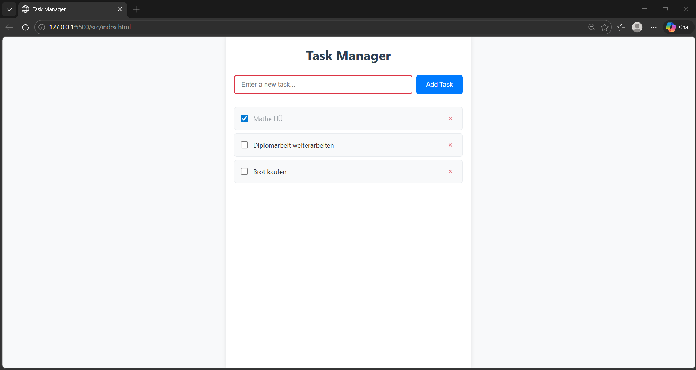

## Application Preview

# Task Manager Web App – Spec Driven Development Demo

This project demonstrates the Spec-Driven Development workflow using GitHub Spec Kit.

## Workflow

1. Constitution
2. Specification
3. Implementation Plan
4. Tasks
5. Implementation

## Features

- Create tasks
- View tasks
- Mark tasks as completed
- Delete tasks
- localStorage persistence

## Tech Stack

- HTML5
- CSS3
- Vanilla JavaScript
- localStorage

## Project Structure

specs/ – specification and planning documents  
src/ – application source code

## Running the Application

Open:

src/index.html
